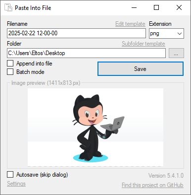

# Paste Into File

[](https://github.com/eltos/PasteIntoFile/graphs/contributors)
[](https://crowdin.com/project/PasteIntoFile)
[](https://codeclimate.com/github/eltos/PasteIntoFile/maintainability)
[](https://github.com/eltos/PasteIntoFile/actions)
[](https://github.com/eltos/PasteIntoFile/releases/latest)
[](https://github.com/eltos/PasteIntoFile/releases)

## About

A Windows desktop application to paste clipboard contents into files and copy file contents to the clipboard via the context menu


_This is a fork of [sorge13248/PasteIntoFile](https://github.com/sorge13248/PasteIntoFile), itself being a fork of [EslaMx7/PasteIntoFile](https://github.com/EslaMx7/PasteIntoFile)._
_See the [contributors page](https://github.com/eltos/PasteIntoFile/graphs/contributors) for details on collaborators._
_It is simmilar but more advanced than [PasteEx](https://github.com/huiyadanli/PasteEx), [Paste As File](https://pasteasfile.org), [PasteHere](https://github.com/tomzorz/PasteHere) or [Paste To File](https://apps.microsoft.com/store/detail/paste-to-file/9PM34S06CFVJ)._
_This fork comes with many new features, a new fluid GUI and new console options._
_The full changelog can be found on the [release page](https://github.com/eltos/PasteIntoFile/releases)._


### Features

+ Explorer context menu entries "[Paste into file](#paste-clipboard-contents)", "[Replace with clipboard content](#replace-with-clipboard-content)" and "[Copy file contents](#copy-file-contents)"
+ Hotkey `Win`+`Alt`+`V` to paste and `Win`+`Alt`+`C` to copy file contents
+ [Autosave mode](https://github.com/eltos/PasteIntoFile/discussions/2): rename inside file explorer without dialog
+ [Batch mode](https://github.com/eltos/PasteIntoFile/discussions/4): monitor clipboard and save on change
+ [Clipboard patching](https://github.com/eltos/PasteIntoFile/discussions/11): use regular paste options and `CTRL`+`V` (experimental)
+ Supports many formats: PNG, JPG, GIF, SVG, TXT, HTML, CSV, URL, PDF, RTF, DIF, SLK, EMF, TIF, ZIP, file drop list, ...
+ First launch wizard




## Installation

Paste Into File is free

+ [**Download latest release** from GitHub](https://github.com/eltos/PasteIntoFile/releases)
  + We provide an **installer** (.msi file)
  + And a **portable version** (.zip file)
+ [Install from Microsoft Store](https://apps.microsoft.com/store/detail/XP88X1XTPKZJDJ)

| [📥 DOWNLOAD](https://github.com/eltos/PasteIntoFile/releases) | [🪙 DONATE](https://github.com/sponsors/eltos) | [❤️ SAY THANKS](https://saythanks.io/to/eltos) | [🌐 TRANSLATE](https://github.com/eltos/PasteIntoFile/issues/18) | [💻 CONTRIBUTE](https://github.com/eltos/PasteIntoFile/contribute)
|---|---|---|---|---|

_Tested on Windows 10._
_If you are running an older Windows version make sure the .NET Framework 4.8+ is installed._
_If the Microsoft Defender SmartScreen promp appears read [this](https://github.com/eltos/PasteIntoFile/discussions/10)._


## Usage

When starting Paste Into File for the first time or after an update, the first launch wizard will guide through the configuration of context menu entry, hotkey, etc.

In addition to the instructions given below, help is also available via [GitHub discussions](https://github.com/eltos/PasteIntoFile/discussions/categories/q-a).


### Paste clipboard contents

This is the main mode of PasteIntoFile which allows saving clipboard contents into files.
To use this mode, run the program from the file explorer context menu, with the hotkey `WIN`+`ALT`+`V` (if enabled), from the tray (if enabled), from the start menu or via command line.
If **clipboard patching** is enabled, the regular paste command and `CTRL`+`V` hotkey can also be used.

If **autosave mode** is enabled, the file to paste will directly be created and selected for renaming.
Otherwise, a dialog will prompt for filename and type.
By holding `SHIFT` when the program starts, the autosave mode setting can be temporarily inverted (show the dialog even though autosave is enabled, or skip the dialog even though autosave is disabled).
When running Paste Into File from the start menu or tray, the dialog will always be shown.

The **filename template** can be edited from the dialog or via command line.
When holding `CTRL` while the program starts, the file will be saved to a subdirectory.
The corresponding template can be configured via command line.

The available **file extensions** depend on the formats available in the clipboard.
For example, if you copy a range of cells from a spreadsheet, the data is available not only as text, but also in DIF, RTF, SLK and HTML formats and even as screenshot.
Either select one of the suggested or enter a custom extension (which will be remembered).
An appropriate format is then chosen automatically[^save_plain_text] and a preview shown.
In autosave mode, the clipboard is saved as image, if available, or else as text.
The file extension is then determined by the last used extension for the respective filetype (which can also be set via command line).

A special **batch mode** exists to monitor the clipboard and save it every time new contents are copied.
If enabled, the filename is purely determined by the template (which supports a dedicated counter variable).

[^save_plain_text]: To force saving plain text data to a file with a special extension,
use uppercase letters or prepend a dot to the file extension (neither will change the actual filename).
For example, when copying syntax highlighted HTML code snippets from a browser,
using `html` will cause the html-formatted text to be saved,
while using `HTML` will save the plain text.


### Replace with clipboard content
The context menu entry **Replace with clipboard content** allows you to paste clipboard contents into existing files by replacing them.
This works as long as the clipboard contains data compatible with the selected file type.
The old file is moved to the recycle bin and can be restored with the usual undo options of the file explorer.


### Copy file contents

To copy the contents of a file to the clipboard, use the file explorer context menu, the hotkey `WIN`+`ALT`+`C` (if enabled) or the command line option.
Currently, image and text files are supported. If the file format is not understood, an error message will be shown.


### Command Line

Use `help`, `help paste`, `help config` etc. as argument to show available command line options, e.g.:
```
> .\PasteIntoFile.exe help
PasteIntoFile 5.0.0.0
Copyright © PasteIntoFile GitHub contributors

  config     Change configuration (without saving clipboard)
  copy       Copy file contents to clipboard
  help       Display more information on a specific command.
  paste      (Default Verb) Paste clipboard contents into file
  tray       Open in tray and wait for hotkey Win + Alt + V
  version    Display version information.
  wizard     Open the first-launch wizard
```
```
> .\PasteIntoFile.exe help paste
PasteIntoFile 5.0.0.0
Copyright © PasteIntoFile GitHub contributors

  -a, --autosave       Autosave file without prompt (true/false)
  -c, --clear          Clear clipboard after save (true/false)
  -d, --directory      Path of directory to save file into
  -f, --filename       Filename template with optional format variables such as
                       {0:yyyyMMdd HHmmSS} for current date and time
                       {1:000} for batch-mode save counter
                       May also contain a file extension and path fragment if
                       used in paste mode.
  --help               Display this help screen.
  --image-extension    Set default file extension for image contents
  --overwrite          (Default: false) Overwrite existing file without prompt.
                       Requires --autosave=true.
  --text-extension     Set default file extension for text contents
  --version            Display version information.
```

**Examples:**
- Add/remove the *Paste Into File* entry in the File Explorer context menu:
   ```powershell
   PasteIntoFile config --register
   PasteIntoFile config --unregister
   ```
- Start *Paste Into File* manually in system tray and react to hotkeys:
   ```powershell
   PasteIntoFile tray
   ```
- En-/disable autostart of *Paste Into File* in system tray on windows startup:
   ```powershell
   PasteIntoFile config --enable-autostart
   PasteIntoFile config --disable-autostart
   ```
- Configure the default filename template format (see [format specifiers](https://docs.microsoft.com/en-us/dotnet/standard/base-types/custom-date-and-time-format-strings)):
   ```powershell
   PasteIntoFile config -f "{0:yyyy-MM-dd HH-mm-ss}"
   ```
- Save clipboard contents in autosave mode to specific location:
  ```powershell
  PasteIntoFile -d the/directory -f the_filename --autosave=true
  ```
- Copy file contents to clipboard:
  ```powershell
  PasteIntoFile copy path_to/the_file
  ```

