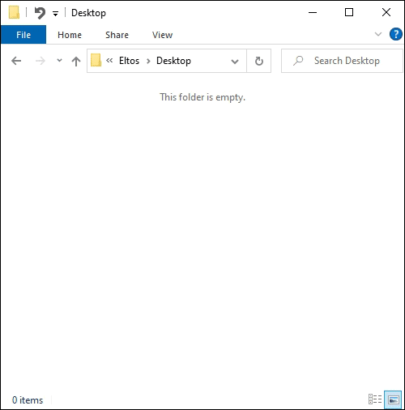

# Paste Into File

[](https://github.com/eltos/PasteIntoFile/graphs/contributors)
[](https://crowdin.com/project/PasteIntoFile)
[](https://codeclimate.com/github/eltos/PasteIntoFile/maintainability)
[](https://github.com/eltos/PasteIntoFile/actions)
[](https://github.com/eltos/PasteIntoFile/releases/latest)
[](https://github.com/eltos/PasteIntoFile/releases)

## About

Are you tired of opening an image/text/office/archive application, paste what you just copied, hit save, select the folder manually and type the filename, just to realise your transparent GIF became a static JPEG with black background?
Paste Into File helps you do all this in a single step, preserving transparency and animations.

With Paste Into File you paste clipboard contents directly into files via file explorer context menu and/or keyboard shortcut, and likewise copy file contents to the clipboard without opening the file.
It can also monitor the clipboard and automatically save or append content in a file/folder/zip as you copy things (batch processing).

_Note: On Windows 11, the context menu entries are located in the extended menu ("show more options"). Use Shift + right click to access it directly; or enable autostart and use keyboard shotcuts._


### Features

+ Explorer context menu entries "[Paste into file](#paste-clipboard-contents)", "[Paste into this file (Append/Replace)](#paste-into-existing-files-appendreplace)" and "[Copy file contents](#copy-file-contents)"
+ Hotkey `Win`+`Alt`+`V` to paste and `Win`+`Alt`+`C` to copy file contents
+ [Autosave mode](https://github.com/eltos/PasteIntoFile/discussions/2): rename directly inside file explorer without a dialog
+ [Batch mode](https://github.com/eltos/PasteIntoFile/discussions/4): monitor clipboard and save contents as you copy them
+ [Clipboard patching](https://github.com/eltos/PasteIntoFile/discussions/11): use regular paste options and `CTRL`+`V` (experimental)
+ Supports many formats: PNG, JPEG, GIF, SVG, TXT, HTML, CSV, URL, PDF, RTF, DIF, SLK, EMF, TIF, ZIP, file drop list, ...
+ First launch wizard

<picture>
  <source media="(prefers-color-scheme: dark)" srcset=".github/screenshot_dark.png">
  <source media="(prefers-color-scheme: light)" srcset=".github/screenshot.png">
  
</picture>
<picture>
  <source media="(prefers-color-scheme: dark)" srcset=".github/screenrecord_dark.gif">
  <source media="(prefers-color-scheme: light)" srcset=".github/screenrecord.gif">
  
</picture>

### Related projects

This project started as a fork of [sorge13248/PasteIntoFile](https://github.com/sorge13248/PasteIntoFile), itself being a fork of [EslaMx7/PasteIntoFile](https://github.com/EslaMx7/PasteIntoFile), both of which are no longer maintained.
It is similar but more advanced than [PasteEx](https://github.com/huiyadanli/PasteEx) (FOSS), [Paste As File](https://pasteasfile.org) (trialware), [PasteHere](https://github.com/tomzorz/PasteHere) (unmaintained), [Paste To File](https://apps.microsoft.com/store/detail/paste-to-file/9PM34S06CFVJ) (no longer available) and [PowerToys Advanced Paste](https://learn.microsoft.com/en-us/windows/powertoys/advanced-paste).

This fork comes with many new features: autosave, batch mode, more formats, keyboard shortcuts, a new fluid GUI and new console options.
The full changelog can be found on the [release page](https://github.com/eltos/PasteIntoFile/releases).
See the [contributors page](https://github.com/eltos/PasteIntoFile/graphs/contributors) for details on collaborators.


## Installation

Paste Into File is free

+ [**Download latest release** from GitHub](https://github.com/eltos/PasteIntoFile/releases) (Installer or portable version)
+ [Install from Microsoft Store](https://apps.microsoft.com/detail/xp88x1xtpkzjdj?cid=github&mode=direct)
+ [Install using WinGet](https://winstall.app/apps/PasteIntoFile.PasteIntoFile)

| [📥 DOWNLOAD](https://github.com/eltos/PasteIntoFile/releases) | [🪙 DONATE](https://github.com/sponsors/eltos) | [❤️ SAY THANKS](https://saythanks.io/to/eltos) | [🌐 TRANSLATE](https://github.com/eltos/PasteIntoFile/issues/18) | [💻 CONTRIBUTE](https://github.com/eltos/PasteIntoFile/contribute)
|---|---|---|---|---|

_Tested on Windows 10 and 11._
_If you are running an older Windows version make sure the .NET Framework 4.8+ is installed._
_If the Microsoft Defender SmartScreen prompt appears read [this](https://github.com/eltos/PasteIntoFile/discussions/10)._


## Usage

When starting Paste Into File for the first time or after an update, the first launch wizard will guide through the configuration of context menu entry, hotkey, etc.

In addition to the instructions given below, help is also available via [GitHub discussions](https://github.com/eltos/PasteIntoFile/discussions/categories/q-a).


### Paste clipboard contents

This is the main mode of Paste Into File which allows saving clipboard contents directly into files.
To use this mode, run the program from the file explorer context menu, with the hotkey `WIN`+`ALT`+`V` (if enabled), from the tray (if enabled), from the start menu or via command line.
If **clipboard patching** is enabled, the regular paste command and `CTRL`+`V` hotkey can also be used.

The file explorer context menu is accessed with a right click on a folder or the file explorer background (for windows 11 it is in the extended context menu ("more options" or SHIFT + right click).
The context menu of existing files allows to replace or append into existing files, preserving filename and file type without showing the dialog.
In the case of replace, the old file is moved to the recycle bin and can be restored with the usual undo options of the file explorer (e.g. `CTRL-Z`).

The **append into file** option allows to append data to existing files.
This works only for supported file types (such as text or zip, not for images) and as long as the clipboard contains data compatible with the selected file type.
If the file does not exist, it is created.
This option is exspecially useful in combination with batch mode (see below).

If **autosave mode** is enabled, the file to paste will directly be created and selected for renaming.
Otherwise, a dialog will prompt for filename and type.
By holding `SHIFT` when the program starts, the autosave mode setting can be temporarily inverted (show the dialog even though autosave is enabled, or skip the dialog even though autosave is disabled).
When running Paste Into File from the start menu or tray, the dialog will always be shown.

The **filename template** can be edited from the UI or via command line (see [below](#template-format) for a description of the available formats).
When holding `CTRL` while the program starts, the file will be saved to a subdirectory.
The corresponding template can be configured from the UI or via command line (see below).

The available **file extensions** depend on the formats available in the clipboard.
For example, if you copy a range of cells from a spreadsheet, the data is available not only as text, but also in DIF, RTF, SLK and HTML formats and even as screenshot.
Either select one of the suggested or enter a custom extension (which will be remembered).
An appropriate format is then chosen automatically[^save_plain_text] and a preview shown.
When selecting `*` as extension or in autosave mode, the file extensions is determined automatically, i.e. the clipboard is saved as image, if available, or else as text. The format is determined by the last used extension for the respective filetype (which can also be set via command line).

A special **batch mode** exists to monitor the clipboard and save it every time new contents are copied.
If enabled, the filename is purely determined by the template and a new file is created for each copy (which supports a dedicated counter variable).
In combination with "append into file", the data is collected in a single file instead (fixed filename).


[^save_plain_text]: To force saving plain text data to a file with a special extension,
prepend a dot to the file extension (the actual filename will still have only a single dot).
For example, when copying syntax highlighted HTML code snippets from a browser,
using `html` will cause the html-formatted text to be saved,
while using `.html` will save the plain text.


### Copy file contents

To copy the contents of a file to the clipboard, use the file explorer context menu, the hotkey `WIN`+`ALT`+`C` (if enabled) or the command line option.
Currently, image and text files are supported. If the file format is not understood, an error message will be shown.
For non-text files, the file path is copied as text in addition to the image contents and file.


<a id="template-format"></a>
### Filename template format
The filename and/or subfolder template string may contain the following placeholders:
- `{0}`: The current date and time, e.g. `{0:yyyy-MM-dd HH-mm-ss}`.
    In addition to the [standard format specifiers](https://docs.microsoft.com/en-us/dotnet/standard/base-types/custom-date-and-time-format-strings),
    `j` for day-of-year and `w` for week-of-year are supported.
- `{1}`: The save counter for batch mode. E.g. `{1:000}` for 3-digit zero padding. See [format specifiers](https://learn.microsoft.com/en-us/dotnet/standard/base-types/custom-numeric-format-strings) for details.
- `{2}`: The clipboard text. E.g. `{2:15}` to limit it to 15 characters.

### Command Line

Use `help`, `help paste`, `help config` etc. as argument to show available command line options, e.g.:
```
> .\PasteIntoFile.exe help
PasteIntoFile 5.3.0.0
Copyright © PasteIntoFile GitHub contributors

  config     Change configuration (without saving clipboard)
  copy       Copy file contents to clipboard
  help       Display more information on a specific command.
  paste      (Default Verb) Paste clipboard contents into file
  tray       Open in tray and wait for hotkey Win + Alt + V
  version    Display version information.
  wizard     Open the first-launch wizard
```
```
> .\PasteIntoFile.exe help paste
PasteIntoFile 5.3.0.0
Copyright © PasteIntoFile GitHub contributors

  --append           (Default: false) Append to file if it exists (and extension supports appending).
  -a, --autosave     Autosave file without prompt (true/false)
  -c, --clear        Clear clipboard after save (true/false)
  -d, --directory    Path of directory to save file into
  -f, --filename     Filename template with optional format variables such as
                     {0:yyyyMMdd HHmmSS} for current date and time
                     {1:000} for batch-mode save counter
                     May also contain a file extension and path fragment if used in paste mode.
  --help             Display this help screen.
  --overwrite        (Default: false) Overwrite existing file without prompt.
                     Requires --autosave=true. If append is also given, this only applies in case appending fails.
  --version          Display version information.
```

**Examples:**
- Add/remove the *Paste Into File* entry in the File Explorer context menu:
   ```powershell
   PasteIntoFile config --register
   PasteIntoFile config --unregister
   ```
- Start *Paste Into File* manually in system tray and react to hotkeys:
   ```powershell
   PasteIntoFile tray
   ```
- En-/disable autostart of *Paste Into File* in system tray on windows startup:
   ```powershell
   PasteIntoFile config --enable-autostart
   PasteIntoFile config --disable-autostart
   ```
- Configure the default filename template format (see [format specifiers](https://docs.microsoft.com/en-us/dotnet/standard/base-types/custom-date-and-time-format-strings)):
   ```powershell
   PasteIntoFile config -f "{0:yyyy-MM-dd HH-mm-ss}"
   ```
- Save clipboard contents in autosave mode to specific location:
  ```powershell
  PasteIntoFile -d the/directory -f the_filename --autosave=true
  ```
- Copy file contents to clipboard:
  ```powershell
  PasteIntoFile copy path_to/the_file
  ```

## Code signing policy

Free code signing provided by [SignPath.io](https://about.signpath.io/), certificate by [SignPath Foundation](https://signpath.org/)
- Committers and reviewers: [Contributors](https://github.com/eltos/PasteIntoFile/graphs/contributors)
- Approvers: [Owner](https://github.com/eltos)

## Privacy Policy

See [PRIVACY](PRIVACY) file

## License

See [LICENSE](LICENSE) file
