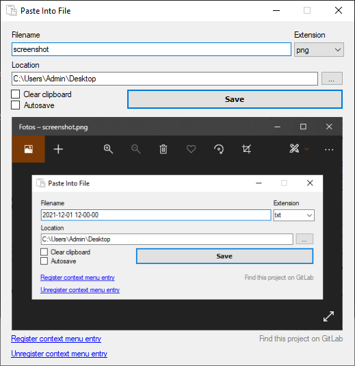

# Paste Into File

A Windows desktop application to paste clipboard contents (text and images) into files

----------------

This is a fork of [PasteIntoFile](https://github.com/EslaMx7/PasteIntoFile) as originally developed by Eslam Hamouda.  
Several major contributions from [fsorge](https://gitlab.com/fsorge/PasteIntoFile) where merged into this project.  
See [all contributors](https://github.com/eltos/PasteIntoFile/graphs/contributors).

----------------

## Features

+ Supports any type of text, source code and images.
+ Change the current saving location or type it yourself.
+ Shortcut in context menu (right click)
+ Automatically clear clipboard after saving to file
+ First launch wizard to register app with Windows Explorer context menu
+ Support for Windows 10 dark theme
+ Support for HiDPI monitors
+ Modern folder selector
+ Image preview before saving





## Installation

+ Tested on Windows 10
+ Make sure you have _.NET Framework 4.5+_ installed in your system. (_Included in Windows 10_)
+ [Download](http://archive.francescosorge.com/paste-into-file) executable as archive (335KB)
+ Run the executable and follow the first-launch wizard


## Configuration

Run the following commands in a terminal (Command Prompt or PowerShell).
- To add the *Paste Into File* entry in the File Explorer context menu:
   ```powershell
   PasteIntoFile /reg
   ``` 
- To remove the *Paste Into File* entry from the File Explorer context menu:
   ```powershell
   PasteIntoFile /unreg
   ``` 
- To change the default filename format:
   ```powershell
   PasteIntoFile /filename yyyyMMdd_HHmmss
   ``` 
   For more information on the format specifiers, see [Custom date and time format strings](https://docs.microsoft.com/en-us/dotnet/standard/base-types/custom-date-and-time-format-strings).

