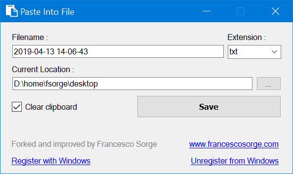

# Paste Into File

[](https://github.com/eltos/PasteIntoFile/graphs/contributors)
[](https://github.com/eltos/PasteIntoFile/actions)
[](https://github.com/eltos/PasteIntoFile/releases/latest)
[](https://github.com/eltos/PasteIntoFile/releases)

## About

A Windows desktop application to paste clipboard contents into files and copy file contents to the clipboard via the context menu


_This is a fork of [sorge13248/PasteIntoFile](https://github.com/sorge13248/PasteIntoFile), itself being a fork of [EslaMx7/PasteIntoFile](https://github.com/EslaMx7/PasteIntoFile)._
_See the [contributors page](https://github.com/eltos/PasteIntoFile/graphs/contributors) for details on collaborators._  
_This fork comes with many new features such as clipboard monitoring, batch mode, rename inside file explorer, copy file contents, paste into subdirectory, system tray mode, listen to hotkey, support for many additional formats and a new GUI with fluid layout and comfortable text, image, HTML and richt-text preview._
_The full changelog can be found on the [release page](https://github.com/eltos/PasteIntoFile/releases)._


## Features

+ Explorer context menu entry: "Paste into file" or "Copy file contents"
+ [Autosave mode](https://github.com/eltos/PasteIntoFile/discussions/2): rename inside file explorer without dialog
+ [Batch mode](https://github.com/eltos/PasteIntoFile/discussions/4): monitor clipboard and save on change
+ Many formats: Image, Text, HTML, CSV, URL, Rich Text Format, Data Interchange Format, Symbolic Link
+ Hotkey `Win`+`Alt`+`V` to paste and `Win`+`Alt`+`C` to copy file contents
+ First launch wizard




## Installation

+ Make sure you have _.NET Framework 4.8+_ installed (_Included in Windows 10_)
+ **[Download the latest version from the release page](https://github.com/eltos/PasteIntoFile/releases)**
  + You can use the installer (.msi file)  
    _Note: since it's unsigned, windows will "protect" you from installing an unknown app. Click "More info" and "Run anyway" to proceed._
  + Or you can download the portable PasteIntoFile.zip, unzip it's contents to a location of your choice and launch the executable to bring up the first-launch wizard

_Tested on Windows 10_

## Usage

The first launch wizard will be shown when running Paste Into File for the first time after installation.
It guides through the most important configuration.
Further options can be accessed through the main GUI or via command line options (see below).

Help is available via [GitHub discussions](https://github.com/eltos/PasteIntoFile/discussions/categories/q-a) 

### Key modifiers

Hold the following keys while launching Paste Into File
- **SHIFT** inverts autosave settings once  
  When autosave is enabled, holding SHIFT will show the dialog anyways  
  When autosave is disabled, holding SHIFT will skip the dialog anyways
- **CTRL** saves to a subdirectory  
  Holding CTRL will save to an intermediate subdirectory  
  The subfolder name supports templates and can be configured via command line options


## Command Line Use

Use `help`, `help paste`, `help config` etc. as argument to show available command line options, e.g.:
```
> .\PasteIntoFile.exe help
PasteIntoFile 4.2.0.0
Copyright © PasteIntoFile GitHub contributors

  paste      (Default Verb) Paste clipboard contents into file
  copy       Copy file contents to clipboard
  config     Change configuration (without saving clipboard)
  wizard     Open the first-launch wizard
  tray       Open in tray and wait for hotkey Win + Alt + V
  help       Display more information on a specific command.
  version    Display version information.
```
```
> .\PasteIntoFile.exe help paste
PasteIntoFile 4.2.0.0
Copyright © PasteIntoFile GitHub contributors

  -d, --directory      Path of directory to save file into
  -f, --filename       Filename template with optional format variables such as
                       {0:yyyyMMdd HHmmSS} for current date and time
                       {1:000} for batch-mode save counter
  --text-extension     File extension for text contents
  --image-extension    File extension for image contents
  --subdir             Template for name of subfolder to create when holding
                       CTRL (see filename for format variables)
  -c, --clear          Clear clipboard after save (true/false)
  -a, --autosave       Autosave file without prompt (true/false)
  --help               Display this help screen.
  --version            Display version information.
```

**Examples:**
- Add/remove the *Paste Into File* entry in the File Explorer context menu:
   ```powershell
   PasteIntoFile config --register
   PasteIntoFile config --unregister
   ``` 
- Start *Paste Into File* manually in system tray and wait for hotkey Win + Alt + V:
   ```powershell
   PasteIntoFile tray
   ``` 
- En-/disable autostart of *Paste Into File* in system tray on windows startup:
   ```powershell
   PasteIntoFile config --enable-autostart
   PasteIntoFile config --disable-autostart
   ``` 
- Configure the default filename template format (see [format specifiers](https://docs.microsoft.com/en-us/dotnet/standard/base-types/custom-date-and-time-format-strings)):
   ```powershell
   PasteIntoFile config -f "{0:yyyy-MM-dd HH-mm-ss}"
   ```
- Save clipboard contents in autosave mode to specific location:
  ```powershell
  PasteIntoFile -d the/directory -f the_filename --autosave=true
  ``` 
- Copy file contents to clipboard:
  ```powershell
  PasteIntoFile copy path_to/the_file
  ``` 


